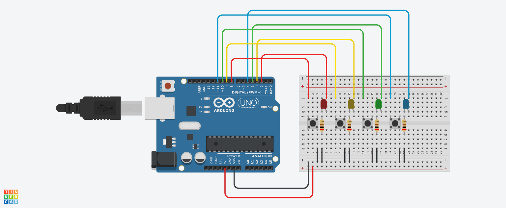

# Genius Game

The objective of this project is to make a version of the Genius Game with Arduino.

## Project Components

- 1x Arduino UNO
- 1x Protoboard
- 4x 5mm LED
- 4x 200Ω resistor
- 4x Button

## Project Sketch

This sketch was made using TinkerCAD software.

  

